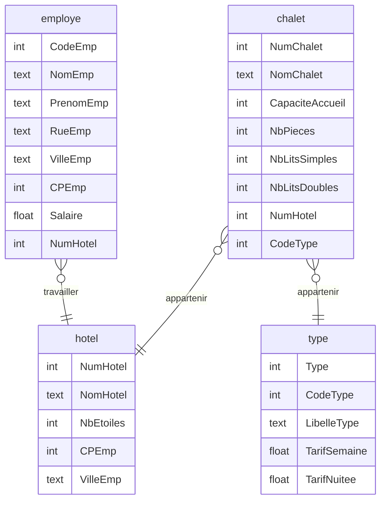

# Auteur
François PARLANT

# Origine
Inspiré de l'annale DCG 2019

# Modèle relationnel

```mermaid
erDiagram
    chalet }o--|| hotel : appartenir
	chalet }o--|| type : appartenir
    chalet {
			int NumChalet
			text NomChalet
			int CapaciteAccueil
			int NbPieces
			int NbLitsSimples
			int NbLitsDoubles
			int NumHotel
			int CodeType
    }
    employe }o--|| hotel : travailler
    employe {
			int CodeEmp
			text NomEmp
			text PrenomEmp
			text RueEmp
			text VilleEmp
			int CPEmp
			float Salaire
			int NumHotel
    }
    hotel {
			int NumHotel
			text NomHotel
			int NbEtoiles
			int CPEmp
			text VilleEmp
    }
	type {
			int Type
			int CodeType
			text LibelleType
			float TarifSemaine
			float TarifNuitee
    }
```

# Activité
Modifier le schéma pour permettre aux employés de travailler dans plusieurs hôtels
