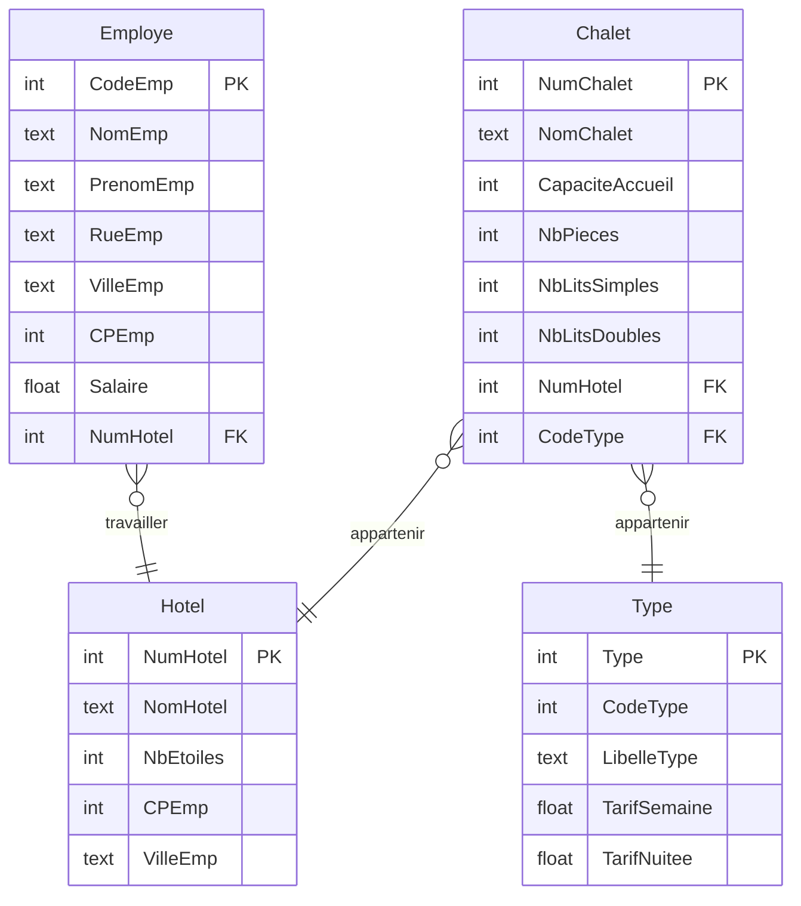

# Auteur
François PARLANT

# Origine
Inspiré de l'annale DCG 2019

# Modèle relationnel

```mermaid
erDiagram
    Chalet }o--|| Hotel : appartenir
	Chalet }o--|| Type : appartenir
    Chalet {
			int NumChalet PK
			text NomChalet
			int CapaciteAccueil
			int NbPieces
			int NbLitsSimples
			int NbLitsDoubles
			int NumHotel FK
			int CodeType FK
    }
    Employe }o--|| Hotel : travailler
    Employe {
			int CodeEmp PK
			text NomEmp
			text PrenomEmp
			text RueEmp
			text VilleEmp
			int CPEmp
			float Salaire
			int NumHotel FK
    }
    Hotel {
			int NumHotel PK
			text NomHotel
			int NbEtoiles
			int CPEmp
			text VilleEmp
    }
	Type {
			int Type PK
			int CodeType
			text LibelleType
			float TarifSemaine
			float TarifNuitee
    }
```